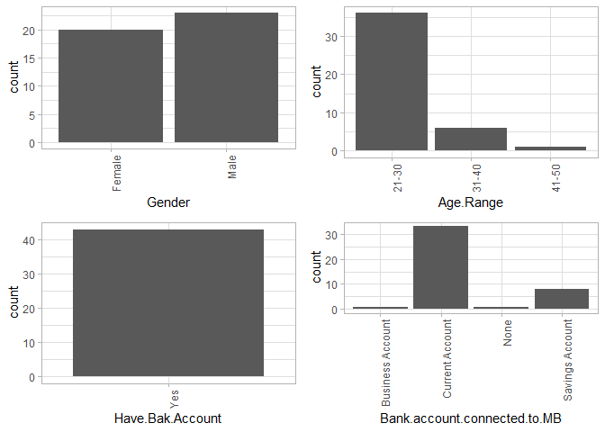
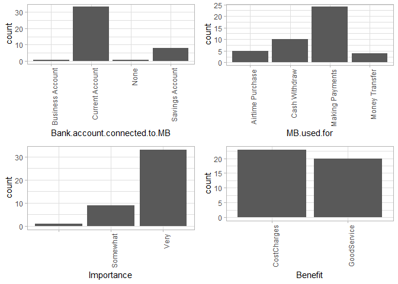
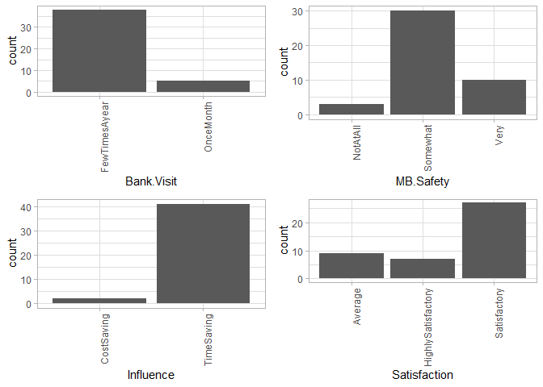

> “The goal is to turn data into information and information into
> insight.” – Carly Fiorina, former chief executive officer, Hewlett
> Packard.

#### INTRODUCTION

If you are familiar with data analysis then I’m certain that you fully
relate to the above statement. After all, it would be pointless to play
around with lots of data just for the love of it, sometimes not but you
get the point.

Data is gold, and the more you have the better off you are. However, raw
unprocessed data is of no use unless you manipulate and gain insights
from it. Before embarking on say statistical modelling and visualization
of your data, it is very important to first have an understanding of the
data itself. Exploratory Data Analysis (**EDA**) aids in visualization,
transformation, and generally cleaning or remodeling data before diving
deep into information extraction.

There are no set rules to be followed when performing EDA. As a data
preparation phase, one is allowed to decide what suits them best in
order to gain an understanding of their data. However, there are two
most important questions one should seek to answer while studying their
data:

-   Is there variation within my variables?
-   Is there any correlation between my variables?

That being said, EDA involves the following checks among others:

-   **Descriptive Statistics** - Gives a summarized understanding of the
    data, usually as measures of central tendency and variability.
    -   **Mean** - Arithmetic average
    -   **Median** - middle value
    -   **Mode** - most frequent value
    -   **Standard Deviation** - variation from the mean
    -   **Kurtosis** -peakedness of the data distribution
    -   **Skewness** - symmetry of the data distribution
-   **Groupings of data**
-   **Missing values**
-   **ANOVA:** Analysis of variance
-   **Graphical visualization**, not restricted to:
    -   **Histogram** -frequency bar plots
    -   **Density estimation** - an estimation if the frequency
        distribution based on sample data
    -   **Box plots** - A visual representation of median, quantiles,
        symmetry and ourtliers
    -   **Scatter plots** - a graphical display of variables plotted on
        the x and y axes.

In this post, we will perform EDA on a sample data set containing
responses to a mobile banking survey in Kenya. If you would like to
follow along with the same data, you can download it
[here](https://github.com/CarlvinJerry/sources/blob/master/data/Mobile%20Banking%20in%20Kenya.csv).

#### DATA IMPORTATION

The code chunk below imports our data set into R.

    #Loading Data into R  toc_depth: 2
    mobileBanking.Df <- read.csv("J://Personalprojects//Blogsite//data//MobileBankinginKenya.csv", header = TRUE, stringsAsFactors = FALSE )
    mobileBanking.Df <- mobileBanking.Df[,-1] #Remove the number column which is Irrelevant

#### 1.0.0 Data Inspection

Once our sample data set is loaded, we check for features present. We
first need to load all the libraries needed for data analysis and
manipulation.

     #Load required packages or install if not present.----
    load.libraries <- c('data.table','tidyverse','gridExtra', 'corrplot', 'GGally', 'ggplot2', 'e1071', 'dplyr')
    install.lib <- load.libraries[!load.libraries %in% installed.packages()]

    for(libs in install.lib) install.packages(libs, dependences = TRUE)

    #Load libraries and flag TRUE
    sapply(load.libraries, require, character = TRUE)

The function above takes in a list of required libraries, checks if they
are already installed and installs them if not. It then loads all the
packages one at a go.

<figure>

<figcaption>
Figure 1: Loaded packages
</figcaption>
</figure>

#### 1.1.0 Observing the data structure

    dim(mobileBanking.Df)
    ## [1] 43 11

The data set has 43 rows with 11 Variables. We therefore explore the
data types of each variable/column.

    #Check Categorical VS Numeric Characters----
    cat_vars <- names(mobileBanking.Df)[which(sapply(mobileBanking.Df, is.character))]
    cat_vars
    ##  [1] "Gender"                       "Age.Range"                   
    ##  [3] "Have.Bak.Account"             "Bank.account.connected.to.MB"
    ##  [5] "MB.used.for"                  "Importance"                  
    ##  [7] "Benefit"                      "Bank.Visit"                  
    ##  [9] "MB.Safety"                    "Influence"                   
    ## [11] "Satisfaction"

    numeric_vars <- names(mobileBanking.Df)[which(sapply(mobileBanking.Df, is.numeric))]
    numeric_vars
    ## character(0)

To identify the data types, we can check for numeric and categorical
variables present in the data. In our case, all the variables in our
data set are categorical. We will therefore explore the data from a
categorical approach rather than numeric. There exists different
visualization methods for different data types. Now that we have
established the general structure of the data, we can check for missing
values, `NAs`.

    #Checking data for any missing values
    colSums(sapply(mobileBanking.Df, is.na))
    ##                       Gender                    Age.Range 
    ##                            0                            0 
    ##             Have.Bak.Account Bank.account.connected.to.MB 
    ##                            0                            0 
    ##                  MB.used.for                   Importance 
    ##                            0                            0 
    ##                      Benefit                   Bank.Visit 
    ##                            0                            0 
    ##                    MB.Safety                    Influence 
    ##                            0                            0 
    ##                 Satisfaction 
    ##                            0

We have no columns with missing values in our data. We can therefore
proceed to analysis without worrying about missing values. In a case
whereby there exists NA values, one can choose whether to replace the
nulls with the most appropriate values or remove the rows with nulls
from the data. This is important for later stages of analysis that
include data modelling, like Machine Learning.

   

#### 1.1.1 Data Summary

    #Data Summary----
    summary(mobileBanking.Df)
    ##     Gender           Age.Range         Have.Bak.Account  
    ##  Length:43          Length:43          Length:43         
    ##  Class :character   Class :character   Class :character  
    ##  Mode  :character   Mode  :character   Mode  :character  
    ##  Bank.account.connected.to.MB MB.used.for         Importance       
    ##  Length:43                    Length:43          Length:43         
    ##  Class :character             Class :character   Class :character  
    ##  Mode  :character             Mode  :character   Mode  :character  
    ##    Benefit           Bank.Visit         MB.Safety        
    ##  Length:43          Length:43          Length:43         
    ##  Class :character   Class :character   Class :character  
    ##  Mode  :character   Mode  :character   Mode  :character  
    ##   Influence         Satisfaction      
    ##  Length:43          Length:43         
    ##  Class :character   Class :character  
    ##  Mode  :character   Mode  :character

 

The base R `Summary()` function comes in handy at summarizing data. In
our case, there is no statistical measures since all our variables are
categorical. Note that the function also specifies the specific data
types. There are more than enough ways to inspect data structures in R.

   

#### 2.0.0 Getting Insights from the data

##### 2.1.0 Descriptive Statistics For Categorical Data

The main goal of descriptive statistics is to inform data analysts on
the main features of either numerical or categorical data, using sample
summaries represented as either tables, individual numbers or charts and
graphs. Since we only have categorical data, I will illustrate the most
used forms of descriptive statistics for the same. However, like I
mentioned earlier, there are more than enough ways to analyze data in R.

 

##### 2.1.1 Frequencies

**Frequencies** illustrate the number of occurrences or observations of
a particular category in data. We use [contigency
tables](https://en.wikipedia.org/wiki/Contingency_table) to present this
information. In R this can be achieved using the ***table()*** function.

From out data, the total distribution of respondents based on gender
looks like this;

    #Gender frequencies
    #library(kableExtra)
    table(mobileBanking.Df$Gender)
    ## 
    ## Female   Male 
    ##     20     23

We can illustrate multiple attributes using cross classification tables
such as;

    #library(kableExtra)
    # Cross classification counts for gender by Mobile banking safety opinion
    table(mobileBanking.Df$Gender, mobileBanking.Df$MB.Safety)
    ##         
    ##          NotAtAll Somewhat Very
    ##   Female        3       11    6
    ##   Male          0       19    4

Multidimensional tables with three or more categories can also be
achieved using the ***ftable()*** . As an example, let’s check out the
number of respondents based on gender, mobile banking safety opinion and
how often they visit the bank.

    #Counts by gender, opinion and bank visits
    table_ <- table(mobileBanking.Df$Gender, mobileBanking.Df$MB.Safety, mobileBanking.Df$Bank.Visit)
    ftable(table_)
    ##                  FewTimesAyear OnceMonth
    ##                                         
    ## Female NotAtAll              3         0
    ##        Somewhat             11         0
    ##        Very                  5         1
    ## Male   NotAtAll              0         0
    ##        Somewhat             15         4
    ##        Very                  4         0

 

##### 2.1.1 Proportions

Proportions are basically contingency tables represented as percentages.
From our previous tables, we can do proportions for the same by applying
***prop.table()*** to output produced by the \***table()** function.
Proportions for the above will then be;

    #library(kableExtra)
    #Gender frequencies proportions
    prop.table(table(mobileBanking.Df$Gender))
    ## 
    ##    Female      Male 
    ## 0.4651163 0.5348837

    #Percentage idistribution for Gender by mobile banking safety
    prop.table(table(mobileBanking.Df$Gender, mobileBanking.Df$MB.Safety))
    ##         
    ##            NotAtAll   Somewhat       Very
    ##   Female 0.06976744 0.25581395 0.13953488
    ##   Male   0.00000000 0.44186047 0.09302326

    #Percentage by gender, opinion and bank visits, rounding off to 2 decimal places
    table_ <- table(mobileBanking.Df$Gender, mobileBanking.Df$MB.Safety, mobileBanking.Df$Bank.Visit)
    ftable(round(prop.table(table_),2))
    ##                  FewTimesAyear OnceMonth
    ##                                         
    ## Female NotAtAll           0.07      0.00
    ##        Somewhat           0.26      0.00
    ##        Very               0.12      0.02
    ## Male   NotAtAll           0.00      0.00
    ##        Somewhat           0.35      0.09
    ##        Very               0.09      0.00

 

##### 2.1.2 Marginals

Marginals measure counts across columns or rows in a contingency table.
***Margin.table()*** gives us the frequencies while ***prop.table()***
gives us the percentages. Using our previous examples on frequencies;

    # FREQUENCY MARGINALS
    # row marginals - totals for each gender across mobile banking opinion
    margin.table(table(mobileBanking.Df$Gender, mobileBanking.Df$MB.Safety), 1)
    ## 
    ## Female   Male 
    ##     20     23

    # colum marginals -  totals for each gender across mobile banking opinion
    margin.table(table(mobileBanking.Df$Gender, mobileBanking.Df$MB.Safety), 2)
    ## 
    ## NotAtAll Somewhat     Very 
    ##        3       30       10

    # PERCENTAGE MARGINALS
    # row marginals - row percentages across gender
    prop.table(table(mobileBanking.Df$Gender, mobileBanking.Df$MB.Safety), margin = 1)
    ##         
    ##          NotAtAll Somewhat     Very
    ##   Female 0.150000 0.550000 0.300000
    ##   Male   0.000000 0.826087 0.173913

    # colum marginals - column percentages acrossmobile banking opinion
    prop.table(table(mobileBanking.Df$Gender, mobileBanking.Df$MB.Safety), margin = 2)
    ##         
    ##           NotAtAll  Somewhat      Very
    ##   Female 1.0000000 0.3666667 0.6000000
    ##   Male   0.0000000 0.6333333 0.4000000

##### 2.2.0 Visualizing Distributions

The code chunk bellow is a function that takes in our data set and plots
all the present variables in it. Since we have categorical variable
only, we will use **bar plots** for visualization. They are the most
appropriate for categorical data.

    #Loading Data into R  toc_depth: 2
    mobileBanking.Df <- read.csv("J://Personalprojects//Blogsite//data//MobileBankinginKenya.csv", header = TRUE, stringsAsFactors = FALSE )
    mobileBanking.Df <- mobileBanking.Df[,-1] #Remove the number column which is Irrelevant

    #Check Categorical VS Numeric Characters----
    cat_vars <- names(mobileBanking.Df)[which(sapply(mobileBanking.Df, is.character))]
    numeric_vars <- names(mobileBanking.Df)[which(sapply(mobileBanking.Df, is.numeric))]

    ####Convert character to factors----
    library(data.table)
    setDT(mobileBanking.Df)[,(cat_vars) := lapply(.SD, as.factor), .SDcols = cat_vars]

    mobileBanking.Df_cat <- mobileBanking.Df[,.SD, .SDcols = cat_vars]
        ##mobileBanking.Df_cont <- mobileBanking.Df[,.SD,.SDcols = numeric_vars]

    #Functions for Plots---
    library(ggplot2)
    library(gridExtra)
    plotHist <- function(data_in, i) {
      data <- data.frame(x=data_in[[i]])
      p <- ggplot(data=data, aes(x=factor(x))) + stat_count() + xlab(colnames(data_in)[i]) + theme_light() + 
        theme(axis.text.x = element_text(angle = 90, hjust =1))
      return (p)
    }

    doPlots <- function(data_in, fun, ii, ncol=3) {
      pp <- list()
      for (i in ii) {
        p <- fun(data_in=data_in, i=i)
        pp <- c(pp, list(p))
      }
      do.call("grid.arrange", c(pp, ncol=ncol))
    }

    plotDen <- function(data_in, i){
      data <- data.frame(x=data_in[[i]], SalePrice = data_in$SalePrice)
      p <- ggplot(data= data) + geom_line(aes(x = x), stat = 'density', size = 1,alpha = 1.0) +
        xlab(paste0((colnames(data_in)[i]), '\n', 'Skewness: ',round(skewness(data_in[[i]], na.rm = TRUE), 2))) + theme_light() 
      return(p)
      
    }

 

#### Variable Distributions

    #Plotting categorical values----
    #Bar plots
    doPlots(mobileBanking.Df_cat, fun = plotHist, ii = 1:4, ncol = 2)

 

#### Gender

It can be seen that a larger number of respondents were male, this is
however by a small margin. If we had a larger data set we could have
more female respondents.

 

#### Age Range

A majority of respondents were younger guys between age **21-30**,
followed by the **31-40** age bracket. The least respondents were those
above age **41**. This could be probably because the older people chose
not to participate in the survey as opposed to the younger ones, or that
they somehow never got to opportunity to do so. A good example is the
medium by which the survey was conducted, which the older people didn’t
have.

 

#### Have Bank Account & Linked To Mobile Banking

All the respondents had bank accounts. A very small number had their
business bank accounts linked to mobile banking. Majority had linked
their current accounts probably due to the convenience that comes with
mobile banking like frequent or timeless withdrawals.

   

 

#### Uses Of Mobile Banking, Importance And Benefits

Most respondents use mobile banking services for making payments. This
is followed by cash withdrawals. Airtime purchase and money transfer
happen to be the least uses for the service. This could be because they
are easily accessible needs unlike cash withdrawal and making payments
in terms of mobility convenience.

Most respondents found mobile banking services **very important**,
probably owing to the affordable cost charges and good service which
could mean less usability issues when using the services.

   

 

#### Bank Visits

We had most users who visit their banks a few times a year while the
least do it once a month. This means that generally, fewer people visit
the bank physically. This could be a major impact of mobile banking
services.

 

#### Mobile Banking Safety, Influence And Satisfaction

Despite being majorly satisfied by the services, most respondents did
not find mobile banking services very safe. It is also seen as time
saving which is probably why we had very few bank visits in general.

 

#### Conclusion from variable distributions

It can be concluded that mobile banking is mainly preferred by younger
people, a majority being of the male gender. However, the only benefit
most users find from mobile banking seems to be the convenience it
brings. Safety is still a major concern.

   

> That’s basically it for exploratory data analysis. I made sure to
> cover the basics, meaning there’s still much to be added on to this;
> more visualizations,
> [packages](https://www.researchgate.net/post/What_are_the_best_R_packages_for_exploratory_data_analysis_of_psychological_data)
> that simplify the whole process etc…This is to be continued. For a
> detailed documentation on the same,
> [here’s](https://r4ds.had.co.nz/index.html) [Hadley
> Wickham’s](https://twitter.com/hadleywickham?ref_src=twsrc%5Egoogle%7Ctwcamp%5Eserp%7Ctwgr%5Eauthor)
> **R for Data Science** book you can use as a reference point.

 

 
