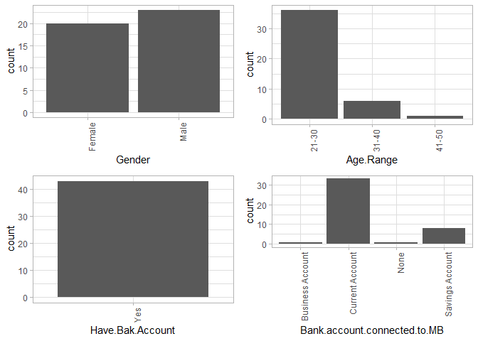
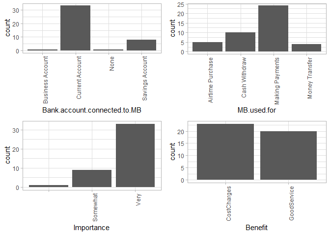
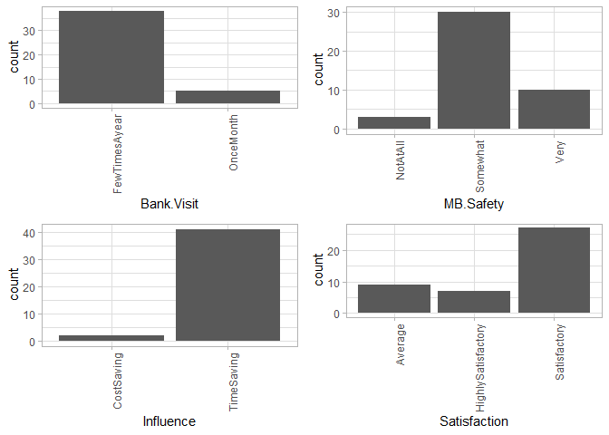

> I got bitten by the famous procrastination bug earlier this year, so I
> missed out on \#TidyTuesday’s week 3(2020) challenge. As a make-up, I
> thought I should do it here instead and maybe someone will learn one
> or two things about security, digital privacy to be precise.

### INTRODUCTION

Exposing ourselves to cyber attacks comes as easy as having access to
the internet. Almost every website you visit will require you to create
an account to be able to access significant information or services from
them - So where exactly does the problem with password strength begin?
Memory methinks…

The whole purpose of memory is to preserve information. Events, names,
faces, mathematical formulae etcetera, all seem recorgnizable every time
we recollect because the mind memorizes them. I don’t know how exactly
remembering works, but you will agree with me on this; the memory is
sometimes very unreliable when it comes to cramming passwords. It is for
this very reason that, in the quest for memorizing our passwords, we
find ourselves using weak passwords.

Different folk memorize passwords differently; some of us share
passwords across platforms (very counter intuitive if you actually think
about it re cyber security), some use personal information such as
names, birthdays, spouse names(ha!) and what have you. My point is, we
cannot fully trust ourselves to match brute force algorithms trying to
hack their way into our facebook(s), instagram(s) and worse for me,
online banking and credit card acconts. So here are a few Ps and Qs for
setting up passwords.

> Small task [here](https://howsecureismypassword.net/), check how long
> it would take a computer to crack your bank account password.

I used [\#TidyTuesday’s
passwords](https://github.com/rfordatascience/tidytuesday/blob/master/data/2020/2020-01-14/readme.md)
data for illustration. To keep it concise, all the code used in this
hidden, click the `CODE` button to expand if you wish to see the code.
Shout out to my good friend and avid data analyst Martin who helped in
building a password strength metter used in ranking passwords used here,
you can read more on the tool
(here)\[<a href="https://ndirangumartin.netlify.app/post/password-meter-in-r/" class="uri">https://ndirangumartin.netlify.app/post/password-meter-in-r/</a>\].
That being said, let’s get visual.

The graph bellow show a scattered distribution of a small fraction of
our compromised passwords. You want to ensure that if your passwords
happen to be on this chart, they are on the bottom far left of the chart
i.e, the passwords are unique and exhibit stronger strengths. That way,
you know that even a computer will take quite some time before cracking
it. The further and lower it is along the x-axis, the greener and
stronger it is.

\#\#\#\#<a href="https://xkcd.com/936/" class="uri">https://xkcd.com/936/</a>

Data Importation
================

The code chunk below imports, cleans and generates the chart from the
data.

#### 1.0.0 Data Inspection

Once our sample data set is loaded, we check for features present. We
first need to load all the libraries needed for data analysis and
manipulation.

The function above takes in a list of required libraries, checks if they
are already installed and installs them if not. It then loads all the
packages one at a go.

<figure>

<figcaption>
Figure 1: Loaded packages
</figcaption>
</figure>

#### 1.1.0 Observing the data structure

    dim(mobileBanking.Df)
    ## [1] 43 11

The data set has 43 rows with 11 Variables. We therefore explore the
data types of each variable/column.

    #Check Categorical VS Numeric Characters----
    cat_vars <- names(mobileBanking.Df)[which(sapply(mobileBanking.Df, is.character))]
    cat_vars
    ##  [1] "Gender"                       "Age.Range"                   
    ##  [3] "Have.Bak.Account"             "Bank.account.connected.to.MB"
    ##  [5] "MB.used.for"                  "Importance"                  
    ##  [7] "Benefit"                      "Bank.Visit"                  
    ##  [9] "MB.Safety"                    "Influence"                   
    ## [11] "Satisfaction"

    numeric_vars <- names(mobileBanking.Df)[which(sapply(mobileBanking.Df, is.numeric))]
    numeric_vars
    ## character(0)

To identify the data types, we can check for numeric and categorical
variables present in the data. In our case, all the variables in our
data set are categorical. We will therefore explore the data from a
categorical approach rather than numeric. There exists different
visualization methods for different data types. Now that we have
established the general structure of the data, we can check for missing
values, `NAs`.

    #Checking data for any missing values
    colSums(sapply(mobileBanking.Df, is.na))
    ##                       Gender                    Age.Range 
    ##                            0                            0 
    ##             Have.Bak.Account Bank.account.connected.to.MB 
    ##                            0                            0 
    ##                  MB.used.for                   Importance 
    ##                            0                            0 
    ##                      Benefit                   Bank.Visit 
    ##                            0                            0 
    ##                    MB.Safety                    Influence 
    ##                            0                            0 
    ##                 Satisfaction 
    ##                            0

We have no columns with missing values in our data. We can therefore
proceed to analysis without worrying about missing values. In a case
whereby there exists NA values, one can choose whether to replace the
nulls with the most appropriate values or remove the rows with nulls
from the data. This is important for later stages of analysis that
include data modelling, like Machine Learning.

   

#### 1.1.1 Data Summary

    #Data Summary----
    summary(mobileBanking.Df)
    ##     Gender           Age.Range         Have.Bak.Account  
    ##  Length:43          Length:43          Length:43         
    ##  Class :character   Class :character   Class :character  
    ##  Mode  :character   Mode  :character   Mode  :character  
    ##  Bank.account.connected.to.MB MB.used.for         Importance       
    ##  Length:43                    Length:43          Length:43         
    ##  Class :character             Class :character   Class :character  
    ##  Mode  :character             Mode  :character   Mode  :character  
    ##    Benefit           Bank.Visit         MB.Safety        
    ##  Length:43          Length:43          Length:43         
    ##  Class :character   Class :character   Class :character  
    ##  Mode  :character   Mode  :character   Mode  :character  
    ##   Influence         Satisfaction      
    ##  Length:43          Length:43         
    ##  Class :character   Class :character  
    ##  Mode  :character   Mode  :character

 

The base R `Summary()` function comes in handy at summarizing data. In
our case, there is no statistical measures since all our variables are
categorical. Note that the function also specifies the specific data
types. There are more than enough ways to inspect data structures in R.

   

### 2.0.0 Getting Insights from the data

#### 2.1.0 Descriptive Statistics For Categorical Data

The main goal of descriptive statistics is to inform data analysts on
the main features of either numerical or categorical data, using sample
summaries represented as either tables, individual numbers or charts and
graphs. Since we only have categorical data, I will illustrate the most
used forms of descriptive statistics for the same. However, like I
mentioned earlier, there are more than enough ways to analyze data in R.

 

##### 2.1.1 Frequencies

**Frequencies** illustrate the number of occurrences or observations of
a particular category in data. We use [contigency
tables](https://en.wikipedia.org/wiki/Contingency_table) to present this
information. In R this can be achieved using the ***table()*** function.

From out data, the total distribution of respondents based on gender
looks like this;

    #Gender frequencies
    #library(kableExtra)
    table(mobileBanking.Df$Gender)
    ## 
    ## Female   Male 
    ##     20     23

We can illustrate multiple attributes using cross classification tables
such as;

    #library(kableExtra)
    # Cross classification counts for gender by Mobile banking safety opinion
    table(mobileBanking.Df$Gender, mobileBanking.Df$MB.Safety)
    ##         
    ##          NotAtAll Somewhat Very
    ##   Female        3       11    6
    ##   Male          0       19    4

Multidimensional tables with three or more categories can also be
achieved using the ***ftable()*** . As an example, let’s check out the
number of respondents based on gender, mobile banking safety opinion and
how often they visit the bank.

    #Counts by gender, opinion and bank visits
    table_ <- table(mobileBanking.Df$Gender, mobileBanking.Df$MB.Safety, mobileBanking.Df$Bank.Visit)
    ftable(table_)
    ##                  FewTimesAyear OnceMonth
    ##                                         
    ## Female NotAtAll              3         0
    ##        Somewhat             11         0
    ##        Very                  5         1
    ## Male   NotAtAll              0         0
    ##        Somewhat             15         4
    ##        Very                  4         0

 

##### 2.1.1 Proportions

Proportions are basically contingency tables represented as percentages.
From our previous tables, we can do proportions for the same by applying
***prop.table()*** to output produced by the \***table()** function.
Proportions for the above will then be;

    #library(kableExtra)
    #Gender frequencies proportions
    prop.table(table(mobileBanking.Df$Gender))
    ## 
    ##    Female      Male 
    ## 0.4651163 0.5348837

    #Percentage idistribution for Gender by mobile banking safety
    prop.table(table(mobileBanking.Df$Gender, mobileBanking.Df$MB.Safety))
    ##         
    ##            NotAtAll   Somewhat       Very
    ##   Female 0.06976744 0.25581395 0.13953488
    ##   Male   0.00000000 0.44186047 0.09302326

    #Percentage by gender, opinion and bank visits, rounding off to 2 decimal places
    table_ <- table(mobileBanking.Df$Gender, mobileBanking.Df$MB.Safety, mobileBanking.Df$Bank.Visit)
    ftable(round(prop.table(table_),2))
    ##                  FewTimesAyear OnceMonth
    ##                                         
    ## Female NotAtAll           0.07      0.00
    ##        Somewhat           0.26      0.00
    ##        Very               0.12      0.02
    ## Male   NotAtAll           0.00      0.00
    ##        Somewhat           0.35      0.09
    ##        Very               0.09      0.00

 

##### 2.1.2 Marginals

Marginals measure counts across columns or rows in a contingency table.
***Margin.table()*** gives us the frequencies while ***prop.table()***
gives us the percentages. Using our previous examples on frequencies;

    # FREQUENCY MARGINALS
    # row marginals - totals for each gender across mobile banking opinion
    margin.table(table(mobileBanking.Df$Gender, mobileBanking.Df$MB.Safety), 1)
    ## 
    ## Female   Male 
    ##     20     23

    # colum marginals -  totals for each gender across mobile banking opinion
    margin.table(table(mobileBanking.Df$Gender, mobileBanking.Df$MB.Safety), 2)
    ## 
    ## NotAtAll Somewhat     Very 
    ##        3       30       10

    # PERCENTAGE MARGINALS
    # row marginals - row percentages across gender
    prop.table(table(mobileBanking.Df$Gender, mobileBanking.Df$MB.Safety), margin = 1)
    ##         
    ##          NotAtAll Somewhat     Very
    ##   Female 0.150000 0.550000 0.300000
    ##   Male   0.000000 0.826087 0.173913

    # colum marginals - column percentages acrossmobile banking opinion
    prop.table(table(mobileBanking.Df$Gender, mobileBanking.Df$MB.Safety), margin = 2)
    ##         
    ##           NotAtAll  Somewhat      Very
    ##   Female 1.0000000 0.3666667 0.6000000
    ##   Male   0.0000000 0.6333333 0.4000000

#### 2.2.0 Visualizing Distributions

The code chunk bellow is a function that takes in our data set and plots
all the present variables in it. Since we have categorical variable
only, we will use **bar plots** for visualization. They are the most
appropriate for categorical data.

    #Loading Data into R  toc_depth: 2
    mobileBanking.Df <- read.csv("J://Personalprojects//Blogsite//data//MobileBankinginKenya.csv", header = TRUE, stringsAsFactors = FALSE )
    mobileBanking.Df <- mobileBanking.Df[,-1] #Remove the number column which is Irrelevant

    #Check Categorical VS Numeric Characters----
    cat_vars <- names(mobileBanking.Df)[which(sapply(mobileBanking.Df, is.character))]
    numeric_vars <- names(mobileBanking.Df)[which(sapply(mobileBanking.Df, is.numeric))]

    ####Convert character to factors----
    library(data.table)

    ## 
    ## Attaching package: 'data.table'

    ## The following objects are masked from 'package:dplyr':
    ## 
    ##     between, first, last

    setDT(mobileBanking.Df)[,(cat_vars) := lapply(.SD, as.factor), .SDcols = cat_vars]

    mobileBanking.Df_cat <- mobileBanking.Df[,.SD, .SDcols = cat_vars]
        ##mobileBanking.Df_cont <- mobileBanking.Df[,.SD,.SDcols = numeric_vars]

    #Functions for Plots---
    library(ggplot2)
    library(gridExtra)

    ## 
    ## Attaching package: 'gridExtra'

    ## The following object is masked from 'package:dplyr':
    ## 
    ##     combine

    plotHist <- function(data_in, i) {
      data <- data.frame(x=data_in[[i]])
      p <- ggplot(data=data, aes(x=factor(x))) + stat_count() + xlab(colnames(data_in)[i]) + theme_light() + 
        theme(axis.text.x = element_text(angle = 90, hjust =1))
      return (p)
    }

    doPlots <- function(data_in, fun, ii, ncol=3) {
      pp <- list()
      for (i in ii) {
        p <- fun(data_in=data_in, i=i)
        pp <- c(pp, list(p))
      }
      do.call("grid.arrange", c(pp, ncol=ncol))
    }

    plotDen <- function(data_in, i){
      data <- data.frame(x=data_in[[i]], SalePrice = data_in$SalePrice)
      p <- ggplot(data= data) + geom_line(aes(x = x), stat = 'density', size = 1,alpha = 1.0) +
        xlab(paste0((colnames(data_in)[i]), '\n', 'Skewness: ',round(skewness(data_in[[i]], na.rm = TRUE), 2))) + theme_light() 
      return(p)
      
    }

 

#### Variable Distributions

    #Plotting categorical values----
    #Bar plots
    doPlots(mobileBanking.Df_cat, fun = plotHist, ii = 1:4, ncol = 2)

 

#### Gender

It can be seen that a larger number of respondents were male, this is
however by a small margin. If we had a larger data set we could have
more female respondents.

 

#### Age Range

A majority of respondents were younger guys between age **21-30**,
followed by the **31-40** age bracket. The least respondents were those
above age **41**. This could be probably because the older people chose
not to participate in the survey as opposed to the younger ones, or that
they somehow never got to opportunity to do so. A good example is the
medium by which the survey was conducted, which the older people didn’t
have.

 

#### Have Bank Account & Linked To Mobile Banking

All the respondents had bank accounts. A very small number had their
business bank accounts linked to mobile banking. Majority had linked
their current accounts probably due to the convenience that comes with
mobile banking like frequent or timeless withdrawals.

   

 

#### Uses Of Mobile Banking, Importance And Benefits

Most respondents use mobile banking services for making payments. This
is followed by cash withdrawals. Airtime purchase and money transfer
happen to be the least uses for the service. This could be because they
are easily accessible needs unlike cash withdrawal and making payments
in terms of mobility convenience.

Most respondents found mobile banking services **very important**,
probably owing to the affordable cost charges and good service which
could mean less usability issues when using the services.

   

 

#### Bank Visits

We had most users who visit their banks a few times a year while the
least do it once a month. This means that generally, fewer people visit
the bank physically. This could be a major impact of mobile banking
services.

 

#### Mobile Banking Safety, Influence And Satisfaction

Despite being majorly satisfied by the services, most respondents did
not find mobile banking services very safe. It is also seen as time
saving which is probably why we had very few bank visits in general.

 

Conclusion from variable distributions
======================================

It can be concluded that mobile banking is mainly preferred by younger
people, a majority being of the male gender. However, the only benefit
most users find from mobile banking seems to be the convenience it
brings. Safety is still a major concern.

   

> That’s basically it for exploratory data analysis. I made sure to
> cover the basics, meaning there’s still much to be added on to this;
> more visualizations,
> [packages](https://www.researchgate.net/post/What_are_the_best_R_packages_for_exploratory_data_analysis_of_psychological_data)
> that simplify the whole process etc…This is to be continued. For a
> detailed documentation on the same,
> [here’s](https://r4ds.had.co.nz/index.html) [Hadley
> Wickham’s](https://twitter.com/hadleywickham?ref_src=twsrc%5Egoogle%7Ctwcamp%5Eserp%7Ctwgr%5Eauthor)
> **R for Data Science** book you can use as a reference point.

 

 
