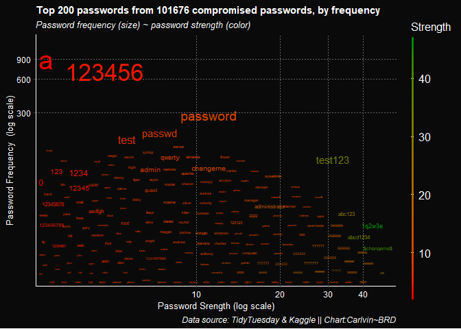

#### INTRODUCTION

Exposing ourselves to cyber attacks comes as easy as having access to
the internet. Almost every website you visit will require you to create
an account to be able to access significant information or services from
them - So where exactly does the problem with password strength begin?
Memory methinks…

The whole purpose of memory is to preserve information. Events, names,
faces, mathematical formulas etcetera, all seem recognizable every time
we recollect because the mind memorizes them. I don’t know how exactly
remembering works, but you will agree with me on this; the memory is
sometimes very unreliable when it comes to cramming passwords. It is for
this very reason that, in the quest for memorizing our passwords, we
find ourselves using weak passwords.

Different folk memorize passwords differently; some of us share
passwords across platforms (very counter intuitive if you actually think
about it re cyber security), some use personal information such as
names, birthdays, pet names 😃 and what have you. My point is, we cannot
fully trust ourselves to match brute force algorithms trying to hack
their way into our Facebook(s), Instagram(s) and worse for me, online
banking and credit card accounts. So here are a few Ps and Qs for
setting up passwords.

> A small challenge for you [here](https://howsecureismypassword.net/),
> check how long it would take a computer to crack your bank account
> password.

I used [\#TidyTuesday’s
passwords](https://github.com/rfordatascience/tidytuesday/blob/master/data/2020/2020-01-14/readme.md)
data with some more compromised passwords from kaggle for illustration.
To keep it concise, all the code used in this post can be found
[here](https://github.com/CarlvinJerry/sources/blob/master/content/post/password-etiquette/index.Rmd).
Shout out to my good friend and avid data analyst
[Martin](https://www.linkedin.com/in/martin-wanjiru-98414111a/) who
helped in building a password strength meter used in ranking passwords
used here, you can read more on the tool
[here](https://ndirangumartin.netlify.app/post/password-meter-in-r/).
That being said, let’s get visual.

 

#### SKIMMING THROUGH THE DATA

The graph bellow shows a scattered distribution of a small fraction of
our compromised passwords. You want to ensure that if your passwords get
parsed through this chart, they are on the bottom, far left of the chart
i.e, the passwords are unique and exhibit stronger strengths. That way,
you know that even a computer will take quite some time before cracking
it. The further and lower it is along the x-axis,the smaller it should
be to indicate uniqueness and the stronger it is hence the green color.

On the contrary, we have quite a lot of passwords clustered in between
0-35 on the strength meter. If you look at those passwords, it should be
quite obvious that they’re weak. This would explain why we have them
here as our data. This chart shows most of the aspects of a password
that I’ll be discussing below.

 

#### CREATING SECURE PASSWORDS

#### 1.Don’t share passwords

I mean, think about your bank accounts if your excuse is “I don’t have
any vital information on me anyway”. Every time you share passwords
across platforms, you make life easier for an attacker. Chances are this
shared password is really strong and so you might think, why not? But
here’s the catch, a wise hacker understands that you might have done
this, and all he has to do is gain access to that account you think has
no information about you and look for an identity. With this little
precious piece of information, it’s easier for them to try out the
accounts you know are actually important. Bank accounts and online
shopping cards could tell you this if they were human.

#### 2.Regularly change your passwords

First of all, if you’re too lazy to change a default password that some
sites offer newbies, you deserve to be hacked. Start by creating a
password of your own. Every now and then, you want to review and update
your passwords because hackers are improving on a daily too.

#### 3.Personal information is a plea to be hacked

I remember using my own name on MySpace for a password, good days those
ones. Times have changed and so should you. Hackers who guess passwords
start basic. Your name will be first, then popular pet names because
they saw you pose with your cats on Facebook. To put it in perspective,
here’s how cute you look to hackers when you use your personal
information as passwords. Same goes for using dictionary words for
passwords.

<figure>

</figure>

#### 4. Longer passwords are safer passwords

#### A look Variable Distributions

Here we have another plot showing distribution of our passwords based on
length.

 

#### 5. 2FA is your friend, use it

Two-factor authentication offers an extra protection to your accounts.
In an event someone cracks your password, they will require a security
code to gain access to the account. This code is usually sent to a
mobile number registered to the said account, one cannot access the
account without keying in the right code. Have it enabled if it’s
available.

<figure>

<figcaption>
Source: [comics](https://xkcd.com/936/)
</figcaption>
</figure>

 

> Much as it’s possible to do all these on your own, a password manager
> is your best shot. With a password manager, you only have to worry
> about one `master password`. A password manager stores all your
> sensitive passwords for you, runs frequent checks on them and
> generates new stronger passwords for you as well, that way your memory
> won’t fail you. Most password managers automatically recognize a
> website whenever visited and will automatically fill in your
> credentials. I personally use the free version of
> [Lastpass](https://www.lastpass.com/), there are many more which are
> entirely free or on subscription basis. You can read more about them
> [here](https://en.wikipedia.org/wiki/Password_manager). Stay safe 😄.

 

 
